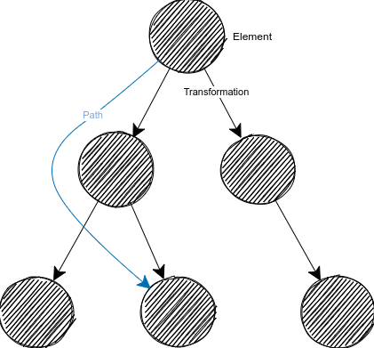

# tf_dude Documentation #
*tf_dude* and the corresponding library shall offer a central way of storing, accessing and manipulating the transformation data across all processing nodes.
It is therefore comparable to [ROS tf](http://wiki.ros.org/tf), however tf_dude is optimized and specialized for
- usage in decentralized architectures with multiple processing nodes
- integration of uncertainty estimation based on [Lie Algebra](https://en.wikipedia.org/wiki/Lie_algebra)
- messaging middleware (aka IPC) independent integration
- additional features like local-clustering, event-based updates, ...

## IPC ##
*tf_dude* is designed to run with any interprocess communication framework which can send service requests (a call must be able to transmit a payload to and from the server).
This universal ability is created by using a generic interface in the core library which is then extended by the specific IPC implementation in the plugin modules.

This means, *tf_dude* has to be build with the correct middleware plugin and the framework must be loaded accordingly.
There are examples for IPC integration with [C++](../examples/cpp/ipc_connection) and [Python](../examples/python/ipc_connection).  

## Transformation Tree and the Forest ##
All transformations a saved in tree-structures.
Per tree, there can only be one root element. 
All other elements must have exactly one parent but can have multiple children.
This ensures that within one tree there is always only one path from one element to another one.

However, the transformation network may include several trees which are denoted as a forest.
These forests all have independent root elements and a path is not possible from one tree to another one.

Each element has two important properties
- an identifier which is unique in the complete network
- a frame object which describes the transformation from the parent element to this one

## CRUD Operations ##
The trees can be modified the clients using the defined CRUD (Create, Read, Update, Delete) functions.
There are examples for this using [C++](../examples/cpp/tree) and [Python](../examples/python/tree).
But they should be only used to manipulate tree structure.
For accessing the data of an element of request path information, use `Handles` provided by the clients function `create_frame_handle(...)` and `create_path_handle(...)`.

## Handles ##
For accessing the data of an element or path, it is highly recommended using the `Handle` classes.
They offer a streamlined way to retrieve transformation information, get uncertainty estimates of a path or update them.
They also hide feature operations like *caching*, *temporal resolution* or other intermediate steps for the user and make sure that all data is inserted correctly.
